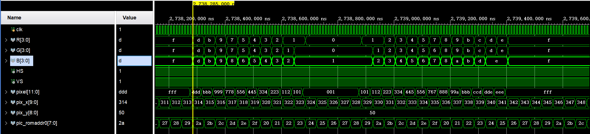
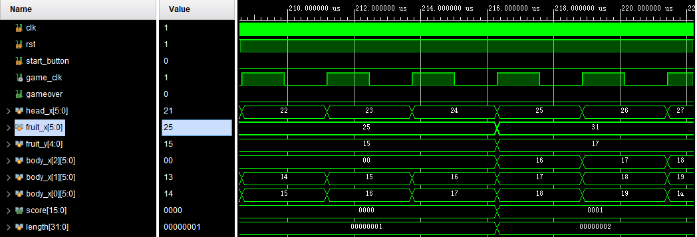

# 仿真与调试过程分析
## 1.PS2
### 上版功能验证
将四个信号对应四个LED灯，上板结果如下：


上板结果分析：成功读取四个按键的信号，PS2编写正确。
## 2.VGA
### 仿真测试

由于单独测试该模块，写了一个临时的计算 $state$ 变量的模块用于测试：


```verilog
module target_v(
    input [9:0] cell_x,
    input [8:0] cell_y,
    output reg [2:0] state
    );

    wire [5:0] cell_addr_x; // 单元格 x 坐标
    wire [4:0] cell_addr_y; // 单元格 y 坐标

    parameter H_PIC = 10'd16;

    assign cell_addr_x = cell_x / H_PIC; // 计算单元格 x 坐标
    assign cell_addr_y = cell_y / H_PIC; // 计算单元格 y 坐标

    always @(cell_x or cell_y) begin // 设置相应的单元格状态
        if (cell_addr_x == 6'd1 && cell_addr_y == 5'd1) begin
            state = 3'd1;
        end else if (cell_addr_x == 6'd2 && cell_addr_y == 5'd1) begin
            state = 3'd2;
        end else if (cell_addr_x == 6'd3 && cell_addr_y == 5'd1) begin
            state = 3'd3;
        end else if (cell_addr_x == 6'd4 && cell_addr_y == 5'd2) begin
            state = 3'd4;
        end else if (cell_addr_x == 6'd5 && cell_addr_y == 5'd2) begin
            state = 3'd5;
        end else if (cell_addr_x == 6'd6 && cell_addr_y == 5'd2) begin
            state = 3'd6;
        end else begin
            state = 3'd0;
        end
    end
endmodule
```

临时 $top$ 模块：

```verilog
module vga_top(
    input clk,
    output [3:0] R, G, B,
    output HS, VS
    );

    wire vga_clk;
    wire [11:0] pixel;
    wire [8:0] pix_y;
    wire [9:0] pix_x;
    wire [2:0] state;

    parameter game_state = 2'b10; // 将 game_state 变量设置为参数，便于在testbench文件中修改
    parameter H_PIC = 5'd16;

    function [9:0] cell_x; // 计算像素点对应单元格的左上角x坐标
        input [9:0] pix_x;
        begin
            cell_x = (pix_x >> 4) * H_PIC;
        end
    endfunction

    function [8:0] cell_y; // 计算像素点对应单元格的左上角y坐标
        input [8:0] pix_y;
        begin
            cell_y = (pix_y >> 4) * H_PIC;
        end
    endfunction

    clk_gen ck_gen0(.clk(clk), .vga_clk(vga_clk));
    vga_ctrl vga_ctrl0(.clk(vga_clk), .rst(1'b0), .Din({pixel[3:0], pixel[7:4], pixel[11:8]}), 
                        .row(pix_y), .col(pix_x), .R(R), .G(G), .B(B), .HS(HS), .VS(VS));
    target_v gen_state(.cell_x(cell_x(pix_x)), .cell_y(cell_y(pix_y)), .state(state));
    vga_screen_pic vga_screen_pic0(.clk(clk), .pix_x(pix_x), .pix_y(pix_y),
                                    .state(state), .game_state(game_state), .pix_data_out(pixel));
endmodule
```

$testbench$ 文件：

```verilog
module vga_tb();
    reg clk;
    wire [3:0] R, G, B;
    wire HS, VS;

    vga_top test(.clk(clk), .R(R), .G(G), .B(B), .HS(HS), .VS(VS));

    // 切换游戏状态
    defparam test.game_state = 2'b00; // 游戏待开始
    // defparam test.game_state = 2'b01; // 游戏进行中
    // defparam test.game_state = 2'b10; // 游戏结束

    initial begin
        clk = 1'b1;
    end

    always begin
        clk = ~clk;
        #5;
    end
endmodule
```

#### 游戏开始

整体图片：


局部细节：



经比对，该数据与 $.coe$ 文件中的数据相同。
## 3.蜂鸣器
### 仿真测试

$testbench$ 文件：

```verilog
module beep_tb();
    reg clk;
    reg [1:0] game_state;

    wire beep;
               
    top_beep test(.clk(clk), .game_state(game_state), .beep(beep));
    
    // 修改参数，缩短仿真时间
    defparam test.bp_go.TIME_125ms = 24'd1249;
    defparam test.bp_go.AS_4 = 18'd21;
    defparam test.bp_go.A4 = 18'd22;
    defparam test.bp_go.GS_4 = 18'd24;
    defparam test.bp_go.G4 = 18'd25;

    defparam test.bp_gs.TIME_125ms = 24'd1249;
    defparam test.bp_gs.A4 = 19'd22;
    defparam test.bp_gs.D5 = 19'd17;
    defparam test.bp_gs.C5 = 19'd19;
    defparam test.bp_gs.B4 = 19'd20;
    defparam test.bp_gs.FS_4 = 19'd27;
    defparam test.bp_gs.G4 = 19'd25;
    defparam test.bp_gs.D4 = 19'd37;
    defparam test.bp_gs.E4 = 19'd30;
    defparam test.bp_gs.F4 = 19'd28;
    defparam test.bp_gs.C4 = 19'd38;

    defparam test.TIME_125ms = 26'd6250;

    initial begin
        clk = 1'b1;
        game_state = 2'b00;
        #100000;
        game_state = 2'b01;
        #100000;
        game_state = 2'b10;
    end

    always begin
        clk = ~clk;
        #5;
    end
endmodule
```

仿真结果已在解释实现步骤时展示。

## 4.状态机
### 仿真代码
```verilog
module test_state(

    );
    reg rst;
    reg clk;
    reg start_button;

    initial begin
        rst=1'b0;
        clk=1'b1;
        start_button=1'b0;
    end
    
    always begin
        #5 clk=~clk;
    end
    always begin
        #100000 rst=1;
        #100000 start_button=1;
        #10 start_button=0;
    end
    
    wire HS,VS;
    wire R,G,B;
    wire AN;
    wire SEG;
    wire LED;
    wire beep;
    top top(.rst(rst),.clk(clk),.start_button(start_button),.ps2_clk(1'b0),.ps2_data(1'b0),.VS(VS),.HS(HS),.R(R),.G(G),.B(B));
    defparam top.run_module0.MAX_CNT =7;
endmodule
```
### 仿真结果

游戏初始为**开始界面**状态(`2'b00`)rst始终置1，当`start_button`置1时游戏进入**游玩中**状态(`2'b01`)；当gameover置为1时，游戏进入结束状态(`2'b10`)；当`start_button`再次置为1时，`gameover`重置为0，同时游戏状态重置为**游玩中**(`2'b01`)

## 5.运动模块
### 5.1 方向控制仿真测试
```verilog
module test_state(

    );
    reg rst;
    reg clk;
    reg start_button;
    reg [1:0]dir;

    initial begin
        rst=1'b0;
        clk=1'b1;
        start_button=1'b0;
        dir=2'b00;
    end
    // always begin
    //     #100 start_button=1;
    //     #100 start_button=0;
    // end
    always begin
        #5 clk=~clk;
    end
    always begin
        #100000 rst=1;
        #100000 start_button=1;
        #10 start_button=0;
    end
    always begin
        #1000 dir=2'b00;
        #1000 dir=2'b01;
        #1000 dir=2'b10;
        #1000 dir=2'b11;
    end
    wire HS,VS;
    wire R,G,B;
    wire AN;
    wire SEG;
    wire LED;
    wire beep;
    top top(.rst(rst),.clk(clk),.start_button(start_button),.ps2_clk(1'b0),.ps2_data(1'b0),.VS(VS),.HS(HS),.R(R),.G(G),.B(B));
    
    defparam top.run_module0.MAX_CNT =7;
endmodule

```

测试每1000ns改变一次dir信号：每当`game_clk`为正边沿时，改变`current_dir`为`dir`，同时有限制条件：当欲改变方向与运动方向相反时，不会发生改变。

激励图中，蛇分别发生向上、向右、向下、向左的运动，xy坐标发生对应正确的变化。

### 5.2 触碰障碍或身体
触碰身体：

人为在 (30,15)放置了一个不动的身体块(即`state[30][15]=3'b010`)，当head坐标移动到(30,15)时`gameover`置1，游戏结束。

---

触碰障碍：

初始不改变蛇移动方向，径直向右移动到最边界(39,15)，`gameover`置1，游戏结束

### 5.3 移动到空白格

图中监测了蛇头的x坐标和两个身子的坐标，以及途径的(21,15)(22,15)(23,15)(24,15)四处位置的状态变化；

可以清楚看到蛇头坐标正确增加的同时，身子坐标随之挪动，并且沿途格子依次状态从空白变为头、身再到空白
### 5.4 吃到食物

初始在(25,15)放置了小食物，在蛇头抵达前score=0和length=1；
当吃到食物后，新产生随机的食物坐标，并且身体增长，body_x[3]出现新的值，length增长，score增加


# 上板结果分析

# 小组成员分工及贡献比例

# 实现过程中所参考的所有代码的链接

